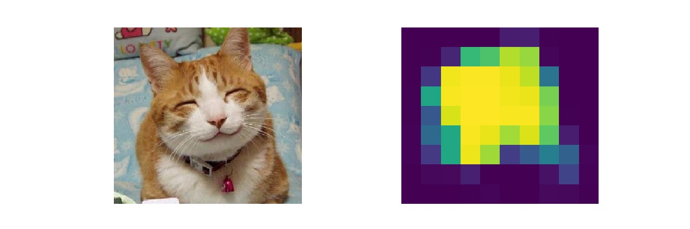

This repository contains some PyTorch scripts for learning object detection using Deep Learning.

## Fully Convolutional Neural Network

I learned its basics from slides and notebooks of [Deep Learning course of Master Datascience Paris Saclay/](https://github.com/m2dsupsdlclass/lectures-labs). The original codes are implemented with Keras and I reimplemented them with PyTorch.

### result

